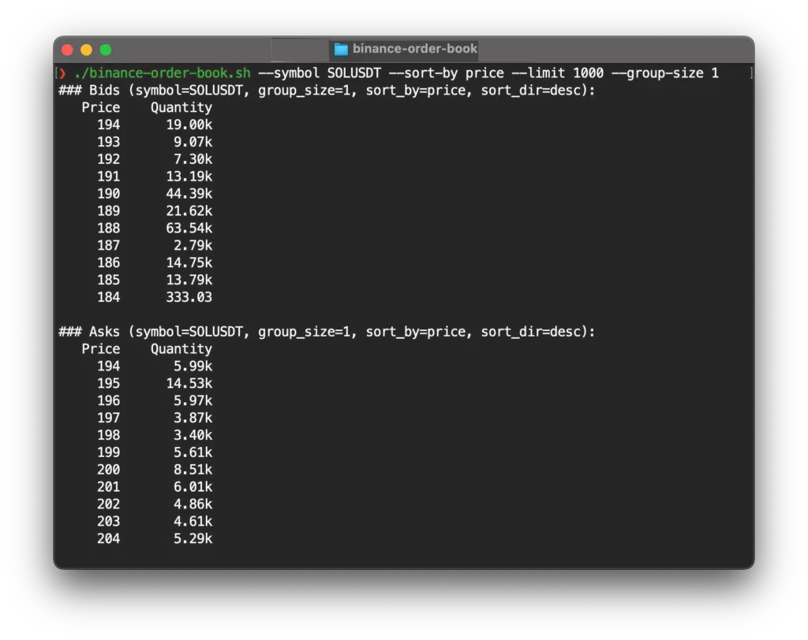

# binance-order-book
Fetches Binance's order book for a given symbol and allow sorting based on the quantity, allowing to potentially find order blocks.

## How to run

You need the `requests` python dependency, so create a virtual env first:

```bash
python3 -m venv env
source env/bin/activate
pip install requests
```

Then you can run the script using:
```bash
./binance-order-book.py
```

## Supported Parameters

- Symbol selection
- Order book number of orders to fetch
- Sorting by price or quantity
- Sorting direction
- Precision or price group size

## Demonstration


